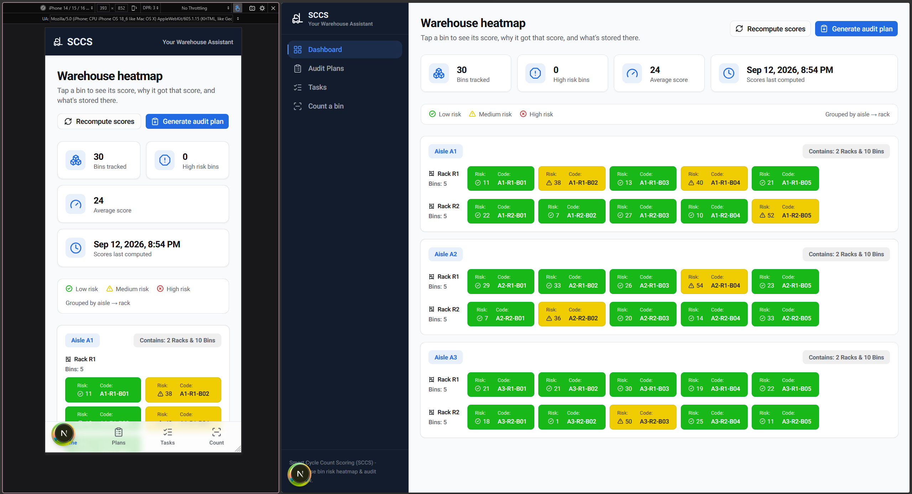

# SCCS — Smart Cycle Count Scoring

A warehouse cycle-count risk-scoring app: every storage bin gets a 0–100 risk score from its
recent activity and audit history, the riskiest bins get pulled into an audit plan, and each
count result feeds back into the score. Built as a full-stack MVP — NestJS + Prisma + PostgreSQL
API, Next.js dashboard.



## How it works

1. **Score** — every bin's risk score is a weighted sum of five factors: days since last audit,
   recent movement frequency, adjustment frequency, past audit fail rate, and product diversity.
2. **Plan** — generate an audit plan for the top-N riskiest bins with one click, or scan/search
   any bin to audit it ad hoc.
3. **Count** — record what's actually in the bin (quantity, pass/fail, notes); the count is
   stamped onto the bin and triggers a full score recompute.

The heatmap dashboard colors every bin low/medium/high risk (green/yellow/red) grouped by
aisle → rack, so you can see at a glance where to look first.

## Project layout

```text
SCCS/
├── back-end/    NestJS + Prisma 8 + PostgreSQL API — see back-end/README.md
└── front-end/   Next.js dashboard (App Router)     — see front-end/README.md
```

Each half has its own README with full setup, architecture, and design-decision notes. This file
is just the map — start here, then jump into whichever side you're touching.

## Tech stack

| Layer        | Stack                                                                                                                            |
| ------------ | -------------------------------------------------------------------------------------------------------------------------------- |
| **Backend**  | NestJS 12, Prisma 8 (contract-first, `@prisma/orm-postgres`), PostgreSQL 15+, Vitest (90%+ coverage), Swagger (Basic Auth-gated) |
| **Frontend** | Next.js 16 (App Router, Turbopack, React 19), TypeScript, TanStack Query v5, Tailwind CSS v4 + shadcn/ui, Recharts               |

## Running it locally

Two separate apps, run in two terminals.

```bash
# 1. Backend — API + database
cd back-end
npm install
cp .env.example .env        # set DATABASE_URL, SWAGGER_USER/PASSWORD
npx prisma db init          # create the schema
npm run seed                # seed a demo warehouse
npm run start:dev           # → http://localhost:3000/api

# 2. Frontend — dashboard
cd front-end
npm install
cp .env.example .env.local  # set API_URL to the backend above
npm run dev                 # → http://localhost:3000 (or next free port)
```

Full details — Supabase connection notes, re-seeding, environment validation, the scoring model,
API reference, testing strategy — live in [`back-end/README.md`](back-end/README.md) and
[`front-end/README.md`](front-end/README.md).

## Repository

[github.com/AlanNin/SCCS](https://github.com/AlanNin/SCCS)
